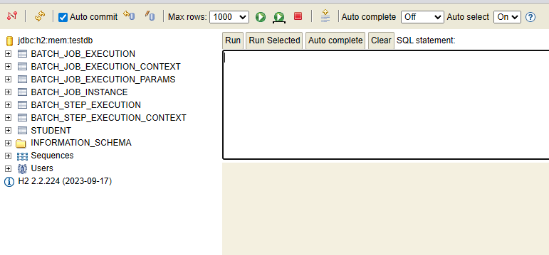
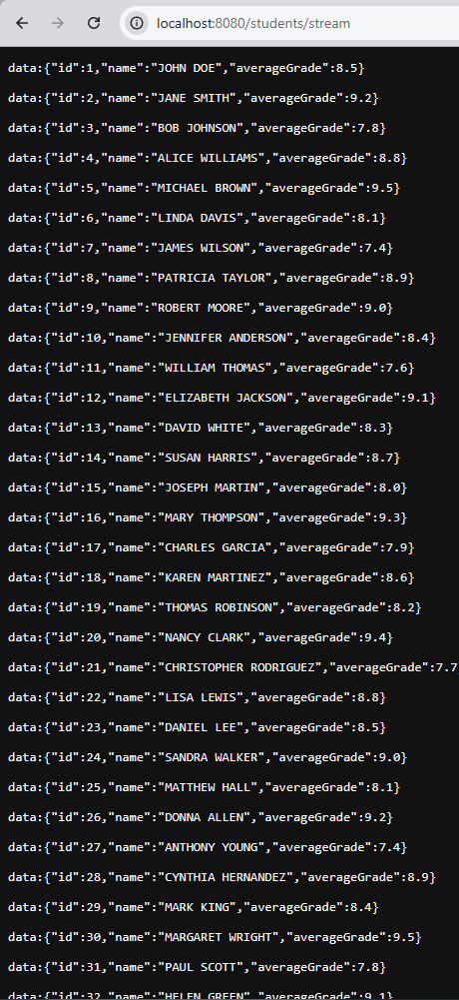

# Student Analytics

### Instrucciones de instalación

Clonar el proyecto: https://github.com/Alenriquez96/prog_concurrente_fb2.git

Proyecto pensado para correr en IntelliJ, aunque se puede correr en Eclipse.

Seguir las instrucciones del IDE para arrancar el spingbootapplication.

🟢 Cómo abrirlo en Eclipse
1️⃣ Abrir Eclipse
2️⃣ File → Import
3️⃣ Existing Maven Projects
4️⃣ Seleccionar la carpeta raíz (donde está el pom.xml)

En eclipse ignorar archivos como .idea/ o .iml

🟢 Cómo abrirlo en Intellyj
1️⃣ Abrir Proyecto con Intellij
2️⃣ Maven -> Reload project (para actualizar dependencias)
3️⃣ Run JobServer (Botón verde)

### Como arrancar la aplicacion

Para iniciar la app, es necesario correr el StudentAnalyticsServer, esto iniciará el servidor web.

Ahora, podremos entrar a la base de datos h2 accedindo a: http://localhost:8080/h2-console

Aquí, introducimos las credenciales de:
 - user: sa
 - password: sa

Deberíamos poder ver ahora la base de datos:

### Spring Batch

Para poder comprobar el buen funcionamiento de Spring Batch, he establecido una lógica que **capitaliza** todos los nombres de los estudiantes y les **transforma la nota** ajustandose a un modelo más español de notas: de 95 -> 9,5

Así, la muestra de datos, que encontamos en _/resources/students.csv_, es:
    
    id,name,averageGrade
    1,John Doe,85
    2,Jane Smith,92
    3,Bob Johnson,78
    4,Alice Williams,88

Y por tanto, los datos transformados producen algo asÍ:

### Api Reactiva

Para lanzar los endpoints, podemos usar curl, postman o el propio navegador.

Según el sistema operativo, podemos usar curl de la sigueinte manera:

 - Linux/Mac (bash): curl -N http://localhost:8080/students

 - Windows (CMD): curl -N "http://localhost:8080/students"

Lo recomendable, al ser todo GET, es usar el navegador.

#### GET /students

Navegar a http://localhost:8080/students con el navegador. 
Saldrán todos los estudiantes.

#### GET /students/top

Navegar a http://localhost:8080/students/top?min=5.
Traerá los estudiantes aprobados. Importante pasar el parámetro de min.

#### GET /students/stream

Navegar a http://localhost:8080/students/stream
Devuelve todos los estudiantes como stream. Vendrán con un intervalo de 50 milisegundos. 

Debería verse bien en cualquier navegador, en el caso contrario probar curl:
CMD -> curl -N http://localhost:8080/students

### Microservicio + Patrones

En este proyecto se simulan patrones de arquitectura de microservicios dentro de un único despliegue. 
El controlador GatewayController actúa como un API Gateway, centralizando las peticiones externas. 
El servicio StudentClientService representa una comunicación entre servicios utilizando WebClient y un Circuit Breaker con Resilience4j. 
Además, se implementa un mecanismo sencillo de trazabilidad mediante un identificador traceId incluido en los logs y en la cabecera HTTP, simulando conceptos de Distributed Tracing y Central Log Analysis.

Para probar el GateWay, debemos hacer petición a /api/public/students

#### GET /api/public/students

Navegar a http://localhost:8080/api/public/students.
Devuelve el flux con todos los empleados de la misma forma que el Controller normal.

#### GET /api/public/students-fail

Navegar o curl a http://localhost:8080/api/public/students-fail.
Forzamos un timeout para que de fallo y salte el fallback del Circuit Breaker.

#### Circuit Breaker (Resilience4j)

Ambos endpoints están protegidos ante fallos con un método fallback que será lanzado cuando ocurra algún error.

#### TraceID

En los logs, comprobamos que el traceID se genera correctamente, por ejemplo:

21:34:34.916 [http-nio-8080-exec-2] INFO  f.s.controller.GateWayController - Gateway recibe petición para /students [traceId=3439eed3-0fad-47c3-bc6e-dbf860d1b2be]

Debería verse algo así por cada request al api gateway.

Esto lo logramos gracias a la línea en application.properties:
`logging.pattern.console=%d{HH:mm:ss.SSS} [%thread] %-5level %logger{36} - %msg [traceId=%X{traceId}]%n`